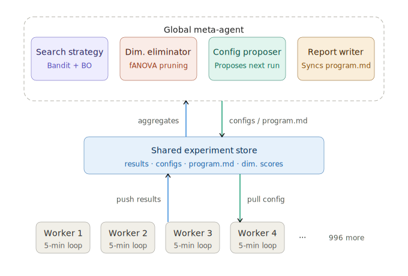
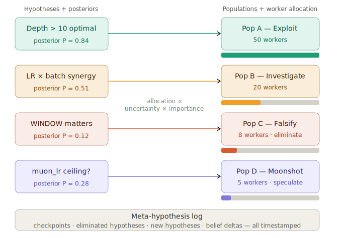
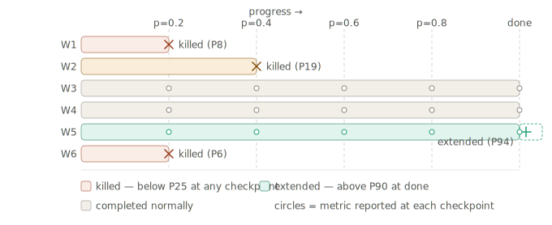
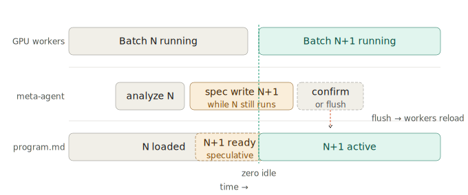

# Bad PI (autoresearch-meta)

**Bad PI: a coordination layer for distributed [autoresearch](https://github.com/karpathy/autoresearch) swarms.**

Autoresearch by yourself is great. Autoresearch with friends is better!!

1000+ workers, each running 5-minute training experiments on their own GPU, coordinated by **Bad PI**: maintaining scientific hypotheses, updating beliefs from evidence, eliminating bad ideas deliberately, and continuously narrowing the search space.

Developer smoke-test / regression guide: [dev_checklist_readme.md](dev_checklist_readme.md)

---

## System architecture



Workers pull a suggested config from Bad PI, run their 5-minute experiment, and push results back. Bad PI aggregates everything and updates the search strategy every 60 seconds. Green arrows carry data upward (results), teal arrows carry directives downward (configs, program.md updates).

---

## Bad PI belief management

Unlike a plain hyperparameter optimizer, the meta-agent maintains *hypotheses* — falsifiable scientific claims — and tracks a probability distribution over each one as experiments arrive.



Each hypothesis is assigned a posterior `P` via Bayesian (Beta-Binomial) updating. Workers are allocated proportionally to *information value*:

```
information_value(H) = uncertainty(H) × importance(H)
                     = 4·P·(1−P)      × expected_impact

worker_allocation(H) ∝ softmax(information_value)
```

To prevent "eternal uncertainty" hypotheses from consuming too much capacity, Bad PI applies an allocation penalty after long indecision streaks and triggers a focused **decision sprint** to force decisive evidence.

For LLM-proposed hypotheses, allocation is intentionally ramped to avoid wasting resources on hallucinations:

```
information_value(H) = 4·P·(1−P) × importance × llm_credibility

llm_credibility = 0.25 at n=0, linearly ramping to 1.0 by n=12
```

So new LLM hypotheses start cheap, then earn full worker share only after accumulating evidence.

- **P ≈ 0.84** (high confidence): mostly exploit — refine around the known good region
- **P ≈ 0.51** (maximum uncertainty): maximum workers — we genuinely don't know
- **P ≈ 0.12** (probably false): deliberate **falsification run** — hold everything fixed, only vary the relevant dimension, run until we have clean statistical evidence
- **P ≈ 0.28** (speculative): small moonshot allocation

### Exact Bayesian update used by the engine

Each hypothesis starts with a mild prior:

```json
{
  "prior": {"alpha": 2, "beta": 2, "posterior": 0.5}
}
```

Each completed experiment is converted into binary evidence:

```json
{
  "experiment": {"delta_bpb": -0.012},
  "outcome": "win"
}
```

- `win` if `delta_bpb < 0`
- `loss` otherwise

Posterior update:

```json
{
  "posterior_update": {
    "alpha": 2 + wins,
    "beta": 2 + losses,
    "posterior_mean": "alpha / (alpha + beta)"
  }
}
```

The engine also computes exact Beta posterior evidence terms:

```json
{
  "bayesian_evidence": {
    "credible_interval_90": [0.41, 0.82],
    "support_probability": "Pr(theta > 0.60)",
    "refute_probability": "Pr(theta < 0.40)",
    "rope_probability": "Pr(0.40 <= theta <= 0.60)"
  }
}
```

Status is decided from posterior mass, not just the mean:

```json
{
  "status_rule": {
    "supported": "support_probability >= 0.90 and n >= 10",
    "refuted": "refute_probability >= 0.90 and n >= 10",
    "active": "otherwise"
  }
}
```

### LLM-suggested hypotheses are gated

The LLM does not generate hypotheses as freeform text. Every proposal goes through a strict three-step pipeline:

**Step 1 — Anthropic `tool_use` call with enforced Pydantic schema**

The PI calls `propose_hypotheses` as a structured tool (`program_writer.py`), so the LLM response is always valid JSON. The `HypothesisProposal` schema the LLM must fill exactly:

```json
{
  "statement":         "Falsifiable claim, e.g. 'DEPTH > 12 interacts with learning_rate'",
  "type":              "positive | comparative | interaction | null",
  "importance":        0.72,
  "rationale":         "1-sentence statistical reason based only on the data shown",
  "config_constraint": {"DEPTH": 12},
  "phase":             "exploration | validation",
  "test_spec":         {"type": "single_factor_effect", "variable": "DEPTH", "values": [8, 12], "min_runs_per_cell": 3, "decision_rule": {"threshold": 0.05}},
  "parent_id":         "optional_parent_hypothesis_id"
}
```

`rationale` is required — the LLM must cite the observed data, not just assert a claim. `config_constraint` holds values that must be frozen for a controlled experiment; empty dict means a global hypothesis. `test_spec` is required for all proposals and defines how the hypothesis will be tested or falsified.

**Step 2 — Registry gate (`HypothesisRegistry.evaluate_llm_proposal`)**

After schema validation, each proposal must pass:

| Gate | Rule |
|---|---|
| `schema_valid` | Pydantic parse succeeded (guaranteed by tool_use) |
| `novel` | Statement text does not normalize-match any existing hypothesis |
| `semantic_novel` | Statement must not be a near-duplicate by semantic similarity |
| `importance_threshold` | `importance >= 0.15` — proposals below this are too vague to test |
| `valid_constraint` | `config_constraint` must be a `dict` |

Accepted example:

```json
{
  "llm_proposal": {
    "statement": "DEPTH > 12 interacts with learning_rate",
    "type": "interaction",
    "importance": 0.72,
    "config_constraint": {}
  },
  "engine_gate": {
    "accepted": true,
    "reason": "schema_valid_and_novel",
    "registry_add": true,
    "immediate_forced_pursuit": false
  }
}
```

Rejected example:

```json
{
  "llm_proposal": {
    "statement": "WINDOW_PATTERN matters",
    "importance": 0.05
  },
  "engine_gate": {
    "accepted": false,
    "reason": "importance_too_low",
    "registry_add": false,
    "immediate_forced_pursuit": false
  }
}
```

**Step 3 — Registry add only, no forced allocation**

Accepted proposals are added with a flat Beta(2,2) prior (P=0.5, maximum uncertainty). They are **not** immediately given workers. Allocation is recomputed at the next cycle from `information_value = 4·P·(1−P) × importance × llm_credibility`.

Adding to the registry does **not** guarantee worker allocation. Allocation still depends on the Bayesian evidence and information value.

---

## What each population gets

Each population receives its own `program.md` generated by the PI (Claude), tailored to its hypothesis and strategy:

| Population | Strategy | What the program.md says |
|-----------|----------|--------------------------|
| **Pop A** | Exploit  | "Best region is depth 12-14, lr 1e-3 to 3e-3. Refine here." |
| **Pop B** | Investigate | "Map the LR x batch interaction surface broadly." |
| **Pop C** | Falsify  | "CONTROLLED: fix all params at best known values. Only vary WINDOW_PATTERN." |
| **Pop D** | Moonshot | "Try unusual/extreme combinations. High variance is fine." |

---

## Population-aware orchestration (live)

The server now maintains a persistent runtime state (`meta_server/runtime.py`) that:

1. **Bootstraps hypotheses from the active `dimensions` table** on a fresh project (`experiment_count == 0`), so the registry starts aligned with the current schema. On non-fresh runs it loads from `runtime_state.json`.
2. **Spawns** a `Population` for each active hypothesis — one population per hypothesis, each with its own strategy and `program.md`.
3. **Assigns** workers to populations on first contact (`/register` or `/next_config`), allocated by Bayesian information-value softmax.
4. **Shapes** every `next_config` response with the hypothesis's `config_constraint` (locked values required for controlled experiments).
5. **Returns** a population-specific `program.md` through `/sync/{worker_id}`, so different worker populations get different research instructions.
6. **Ingests** each completed experiment result into the relevant hypotheses, updates Beta posteriors, and re-syncs populations.
7. **Archives** refuted hypotheses (status=`refuted`, n≥12) and frees their workers.
8. **Generates** hypothesis proposals from the LLM on the global `program.md` write cycle, gates them through `HypothesisRegistry.ingest_llm_proposals`, and only adds accepted ones.
9. **Checkpoints** the meta-hypothesis log every 100 experiments.
10. **Persists** all state to `runtime_state.json` (path configurable via `META_RUNTIME_STATE_PATH`).

### Lakatos layer (additive)

Bad PI now includes an additive `ProgrammeRegistry` layer (`meta_server/lakatos.py`) above hypothesis updates:

- `ResearchProgramme` = hard core + protective belt (linked hypothesis IDs)
- Refuted auxiliaries are treated as anomalies and queued as pending belt modifications
- Programme health is tracked by a progressiveness ratio over resolved novel predictions
- In `lakatos`/`hybrid` mode, worker allocation applies programme-level pressure:
  progressive programmes receive more discretionary workers, degenerative programmes are down-weighted
- Existing mechanics (Beta-Binomial, test_spec, populations, worker protocol) are unchanged

### What workers see in `next_config` (population-aware)

```json
{
  "exp_id": "a1b2c3d4-...",
  "config_delta": {"DEPTH": 12, "learning_rate": 0.0018},
  "budget_seconds": 420,
  "priority": 0.72,
  "note": "exploit · pop_a8365b — Depth > 10 improves val_bpb",
  "population_id": "pop_a8365b",
  "population_strategy": "exploit",
  "hypothesis_id": "9f3c1a",
  "hypothesis_statement": "Depth > 10 improves val_bpb"
}
```

### What workers see in `/sync/{worker_id}`

```json
{
  "program_md": "# pop_a8365b — EXPLOIT\n*...*",
  "experiment_count": 347,
  "active_workers": 24,
  "population_id": "pop_a8365b",
  "population_strategy": "exploit",
  "hypothesis_id": "9f3c1a",
  "hypothesis_statement": "Depth > 10 improves val_bpb",
  "dimensions": [...],
  "top_configs": [...]
}
```

### Runtime state persistence

```
meta_server/
  runtime_state.json        ← persistent registry + population assignments
  meta_hypothesis_log.md    ← checkpoint journal (auto-written every 100 exps)
```

Configurable via environment:
```
META_RUNTIME_STATE_PATH=/data/runtime_state.json  # default: meta_server/runtime_state.json
BAD_PI_SCIENCE_MODE=popper                # popper | lakatos | hybrid
```

Each hypothesis now also tracks an effect-size Gaussian summary (`effect_mu`, `effect_sem`) alongside Beta-Binomial evidence.

---

## Theory graph endpoint

Inspect parent/child and linked hypothesis structure:

- `GET /theory_graph` → `{ "nodes": [...], "edges": [...] }`
- `GET /theory_graph/human` → human-readable derived summary layer
- `GET /science_mode` → active reasoning mode + available modes
- `GET /programmes` → Lakatosian programme health snapshot
- `GET /programmes/belt_modifications` → pending protective-belt modification suggestions

Edge types:
- `decomposes_into` (parent → child)
- `linked` (related hypotheses)

The graph JSON is the source of truth. The `/theory_graph/human` response is explicitly derived (`derived_not_authoritative=true`) and can use LLM translation with deterministic fallback.

---

## Safe auto-adoption of new dimensions (stall recovery)

When search is stalled, Bad PI still asks the LLM for **new dimensions** (not just new hypotheses). Those proposals can now be auto-adopted into live search only if all gates pass:

1. Schema-valid and unique dimension name
2. Repeated signal: same normalized proposal appears in at least 2 stall cycles
3. Bounded search space
  - numeric ranges must be sane (`min < max`, capped span)
  - categorical proposals capped at 8 categories
4. Canary phase on adoption
  - starts with low importance and canary sampling probability (~12% of proposed configs)
  - evaluated after 40 completed experiments
  - auto-reverted if best delta does not improve by at least 0.001

If canary improves best delta enough, it is promoted to normal full-search behavior automatically.

---

## Executable test specs (all hypotheses)

Every LLM-proposed hypothesis must include an executable `test_spec` that defines how to test or falsify the claim. The `phase` field indicates the maturity level:

- `phase="exploration"` → hypothesis is early-stage; test_spec guides signal collection and incremental belief updates
- `phase="validation"` → hypothesis is mature; test_spec is a strict deterministic protocol with fixed sample sizes and decision thresholds

Two deterministic test types are live in v1:

1. `single_factor_effect`
  - Vary one variable over specific arms (e.g. `DEPTH` in `[8, 12]`)
  - Require `min_runs_per_cell` repeats per arm
  - Compute arm means and compare effect size to `decision_rule.threshold`

2. `interaction_grid`
  - Build a 2D grid over two variables (e.g. `DEPTH` × `learning_rate`)
  - Fill each cell to `min_runs_per_cell`
  - Compute deterministic interaction strength (deviation from additive expectation)
  - Mark test win/loss by threshold

How they work together in practice:

- Use `single_factor_effect` first to verify a clean main effect.
- Use `interaction_grid` next to test whether variable combinations produce non-additive gains.

Important: for validation hypotheses, Bad PI updates belief on **completed tests** (one vote per completed protocol), not every individual run.

Detailed spec and examples: [docs/testspec_validation.md](docs/testspec_validation.md)

---

## Meta-hypothesis log

Every 100 experiments the PI writes a new checkpoint to `meta_hypothesis_log.md`:

```markdown
## Checkpoint 4  ·  350 experiments  ·  2026-04-07 14:22

### Belief movements
| Hypothesis                     | Prior P | Current P | Delta  | n  | Status    |
|--------------------------------|---------|-----------|--------|----|-----------|
| Depth > 10 improves val_bpb    | 0.72    | 0.84      | +0.12  | 40 | supported |
| LR x batch size interact       | 0.38    | 0.51      | +0.13  | 22 | active    |
| WINDOW_PATTERN affects val_bpb | 0.34    | 0.12      | -0.22  | 22 | refuted   |

### Eliminated this cycle
**WINDOW_PATTERN affects val_bpb** — REFUTED (P=0.12, n=22)
> Evidence: [n=20] WIN delta=-0.011 | [n=21] LOSS delta=+0.002 | [n=22] WIN delta=-0.008

### New hypotheses generated
- **"Depth x learning rate interaction"** — P=0.50 (NEW)
  Rationale: high-depth experiments show different LR sensitivity curves

### Population changes
- Pop C dissolved (WINDOW refuted) — 8 workers freed
- Spawned pop_e3f1a2 (investigate, 15 workers) for "Depth x learning rate interaction"
```

This log is the *institutional memory* of the swarm.

---

## Early stopping with progress buckets



Workers report a compact tick at each 20% progress checkpoint:

```json
{ "id": "run-uuid", "p": 0.2, "m": 1.9, "d": -0.05 }
```

The scheduler compares the metric against all other runs that have reached that bucket. Kill decisions are **probabilistic** — being below the cutoff is not an automatic death sentence. Kill probability scales linearly with depth below the threshold:

```
p_kill = STOCHASTIC_KILL_MAX_PROB × (threshold_pct − rank_pct) / threshold_pct
       = 0.65 × (33.3 − rank_pct) / 33.3      [with eta=3]
```

| Rank percentile in pool | Kill probability |
|---|---|
| 33rd pct (at the cutoff) | 0% — no risk |
| ~10th percentile | ~46% |
| 0th pct (absolute worst) | 65% |

A run that ranks poorly in one bucket may survive the stochastic reprieve and recover in the next. A consistently bad run accumulates kill draws across multiple buckets and approaches near-certainty of termination. The scheduler avoids being overconfident about single noisy measurements.

The agent responds immediately to each tick:

```json
{ "action": "stop" }                   // stochastic kill fired
{ "action": "extend", "budget": 420 }  // extend — top 11% at final bucket
{}                                     // continue (or stochastic reprieve)
```

This creates three distinct run shapes: short killed runs (coral), full normal runs (gray), and extended top-performer runs (teal, with a dashed extra segment). Only the useful compute budget is consumed.

Run lifecycle: `start → update (×5) → complete | stop | extend → complete`

---

## Pipelined swarm: zero idle time



Writing a new `program.md` via the Claude API takes ~30 seconds. Without pipelining, every batch transition causes a GPU idle gap.

The pipeline solves this with ideas from CPU architecture:

**Speculative execution** — after 10 ticks arrive from the current batch, the meta-agent analyzes early trends, estimates confidence, and starts drafting the next `program.md` in the background. By the time Batch N finishes, `program N+1` is already `READY`.

**Zero idle** — workers pre-cache the speculative program via `GET /pipeline/spec` (or structured `GET /pipeline/spec_payload`) between runs. When Batch N ends they load N+1 instantly.

**Pipeline flush** — if a late-arriving anomaly (outlier result, hypothesis flip) invalidates the prediction, `POST /pipeline/flush` is called. Workers polling `GET /pipeline/flush_token` detect the token mismatch and re-pull from `/program.md`. A new spec is drafted for the corrected direction.

The pipeline tracks a hit rate (`confirmed / (confirmed + flushed)`). A well-calibrated swarm with stable hypotheses achieves 80-90% hit rate, meaning GPUs are idle for only 10-20% of transitions instead of 100%.

### Optional speculative auto-deploy mode (confidence-gated)

This mode is **off by default**. When enabled, workers can use predicted `program.md` early, before normal sync.

Deployment is gated by two confidence checks:

1. **Spec confidence** — confidence of the current predicted spec.
2. **Deployment confidence bank** — long-term trust score that increases on confirmed predictions and drops on flushes.

If a deployed prediction is later wrong, a flush is issued and the confidence bank takes a penalty. The bank must rebuild above threshold before speculative deploy is allowed again.

Server env vars:

```bash
BAD_PI_SCIENCE_MODE=popper
BAD_PI_SPEC_EXEC_ENABLED=1
BAD_PI_SPEC_AUTO_DEPLOY=1
BAD_PI_SPEC_CONF_THRESHOLD=0.65
BAD_PI_DEPLOY_CONF_THRESHOLD=0.70
BAD_PI_PIPELINE_BATCH_EVERY=20
```

Worker opt-in flag:

```bash
python worker/run.py --use-spec-pipeline
```

Worker flow in this mode:
- preloads `GET /pipeline/spec_payload`
- checks `GET /pipeline/flush_token`
- if token matches cached spec id, drops speculative file and re-syncs from `/sync/{worker_id}`.

### Duplicate-trial balancing (confidence vs resource waste)

Queueing now uses a duplicate policy per exact `config_delta` fingerprint:

- high-priority configs get a few repeats for confidence
- hard cap on total repeats per config
- cap on simultaneous in-flight duplicates

Current defaults:

```text
MAX_TRIALS_PER_CONFIG   = 6
MAX_INFLIGHT_PER_CONFIG = 2
priority >= 0.85  -> desired repeats 4
priority >= 0.70  -> desired repeats 3
priority >= 0.55  -> desired repeats 2
else              -> desired repeats 1
```

This gives repeated validation for promising configs without flooding the cluster with identical runs.

---

## Simulating locally (no GPU needed)

```bash
# Simulate 50 concurrent workers and 3 rounds locally
python simulate.py

# More workers, more rounds
python simulate.py --workers 100 --rounds 5

# Run against a live meta-agent server
python simulate.py --against-server --meta-url http://META_IP:8000
```

The simulator uses a synthetic `simulate_metric(config, progress)` function that mimics a realistic noisy training curve. It lets you validate the early stopping thresholds and pipeline behavior without any GPUs.

---

## Quick start

### 1. Deploy the meta-agent (organiser only, once)

```bash
git clone https://github.com/yourname/autoresearch-meta
cd autoresearch-meta

# With Docker (recommended)
ANTHROPIC_API_KEY=sk-... META_ENROLL_TOKEN=team-shared-invite docker compose up -d

# Without Docker
pip install -r meta_server/requirements.txt
uvicorn meta_server.main:app --host 0.0.0.0 --port 8000
```

> A $6/mo cloud VM is plenty — the server is CPU-only.
> Share `http://YOUR_VM_IP:8000` with all workers.

### 1a. Very explicit organizer setup (recommended for first-time teams)

If you are the person hosting the meta-agent, do this exactly:

#### Step 1 — pick or generate an invite token

This is the **shared secret** that workers need the first time they register.

Use one of these commands to generate a strong token:

```bash
# Python (works on most machines)
python -c "import secrets; print(secrets.token_urlsafe(24))"

# Or OpenSSL
openssl rand -base64 24
```

Example result:

```text
5qD7nL4sF2KjV8vQmYp2bZ0uHcT9xA1e
```

Call this your **enroll token**.

#### Step 2 — start the server with that token

```bash
export META_ENROLL_TOKEN="PASTE_YOUR_TOKEN_HERE"
export ANTHROPIC_API_KEY="sk-..."   # optional
docker compose up -d
```

If you are **not** using Docker:

```bash
export META_ENROLL_TOKEN="PASTE_YOUR_TOKEN_HERE"
pip install -r meta_server/requirements.txt
uvicorn meta_server.main:app --host 0.0.0.0 --port 8000
```

#### Step 3 — verify the server is live

Open this in a browser:

```text
http://YOUR_VM_IP:8000/health
```

You should see JSON like:

```json
{
  "status": "ok",
  "experiments": 0,
  "queue_depth": 200,
  "active_workers": 0
}
```

#### Step 4 — send workers exactly two things

```json
{
  "meta_url": "http://YOUR_VM_IP:8000",
  "enroll_token": "PASTE_YOUR_TOKEN_HERE"
}
```

That is all they need to join.

### 1b. Very explicit worker onboarding (first-time teammate)

If you are a teammate joining the swarm, you need:

```json
{
  "meta_url": "http://YOUR_VM_IP:8000",
  "enroll_token": "THE_TOKEN_THE_ORGANIZER_SENT_YOU"
}
```

Then do this exactly once:

1. Clone this repo
2. Install worker requirements
3. Make sure your `train.py` follows the contract below
4. Run `worker/setup_worker.py`
5. Start `worker/run.py`

What happens during setup:

```json
{
  "step_1": "run your unmodified train.py once to measure baseline",
  "step_2": "send worker_id + gpu_type + baseline_bpb + enroll_token to /register",
  "step_3": "server verifies enroll token",
  "step_4": "server returns a private worker_token",
  "step_5": "worker saves worker_token into .worker_config.json",
  "step_6": "future requests use X-Worker-Token automatically"
}
```

Important: after setup, you do **not** need to type the token again. The worker stores it and uses it automatically.

### 2. Worker setup (each participant, once)

```bash
git clone https://github.com/yourname/autoresearch-meta
cd autoresearch-meta
pip install -r worker/requirements.txt

python worker/setup_worker.py \
    --worker-id  YOUR_NAME        \
    --gpu-type   H100             \
    --train-py   /path/to/autoresearch/train.py \
  --meta-url   http://META_IP:8000 \
  --enroll-token YOUR_ENROLL_TOKEN
```

Example:

```bash
python worker/setup_worker.py \
  --worker-id alice-h100 \
  --gpu-type H100 \
  --train-py /Users/alice/autoresearch/train.py \
  --meta-url http://203.0.113.10:8000 \
  --enroll-token 5qD7nL4sF2KjV8vQmYp2bZ0uHcT9xA1e
```

If setup succeeds, it will:
- print the current `program.md`
- save a local `worker/.worker_config.json`
- store your private `worker_token` there
- tell you to run `python worker/run.py`

If the enroll token is wrong, registration will fail with `401 Invalid enroll token`.

### Required train.py contract (everyone must do this)

To avoid confusion, every worker's `train.py` should follow this contract before running `setup_worker.py`.

#### Checklist

1. **Expose tunable top-level constants** (plain `KEY = value` assignments)
2. **Include `TOTAL_WALL_CLOCK_TIME`** as a top-level constant
3. **Call `report(metric, progress)`** at each evaluation/checkpoint in training

If this contract is missing, workers may still run, but you lose key meta-agent behavior:
- no reliable patching of hyperparameters
- no dynamic budget control
- no early stopping / extension decisions

#### Minimal template (copy/paste pattern)

```python
# ---- agent-patchable top-level constants ----
# These must match the active schema dimensions.
# Current default profile in this repo (MNIST demo):
LR = 1e-3
BATCH_SIZE = 32
HIDDEN_SIZE = 128
N_LAYERS = 2
WEIGHT_DECAY = 1e-4
OPTIMIZER = "adam"

# Required: worker/run.py patches this every run
TOTAL_WALL_CLOCK_TIME = 300

from worker.report import report

def train_loop():
  # Example: report at 5 checkpoints (20%,40%,60%,80%,100%)
  for step in range(total_steps):
    # ... training ...
    if should_eval(step):
      val_bpb = evaluate()
      progress = step / max(1, total_steps)
      report(val_bpb, progress)
```

#### Notes

- `progress` must be between `0.0` and `1.0`.
- Metric should be **lower-is-better** (for nanochat this is `val_bpb`).
- Keep constants as simple top-level assignments so patching works reliably.

### 3. Start the loop

```bash
python worker/run.py
```

Pull config → patch train.py → run 5 min → push result → repeat, forever.

### Lightweight worker security

This repo now supports a fast, low-overhead worker authentication model:

```json
{
  "registration": {
    "requires_enroll_token": true,
    "server_env": "META_ENROLL_TOKEN",
    "worker_cli": "--enroll-token"
  },
  "after_registration": {
    "server_issues": "per-worker token",
    "worker_stores": ".worker_config.json",
    "worker_sends": "X-Worker-Token header on protected endpoints"
  }
}
```

Protected worker endpoints:

```json
{
  "protected": [
    "/next_config/{worker_id}",
    "/result",
    "/sync/{worker_id}",
    "/tick",
    "/runs/start/{worker_id}"
  ],
  "public_read_only": [
    "/health",
    "/leaderboard",
    "/program.md",
    "/runs/active",
    "/runs/stats",
    "/pipeline/status",
    "/pipeline/spec",
    "/pipeline/flush_token",
    "/meta_log"
  ]
}
```

This keeps the system light and fast:
- no OAuth
- no external identity service
- one shared invite token for onboarding
- one per-worker token for ongoing authenticated access

For a small trusted team on one project, this is usually the right tradeoff.

### Exact connection flow (what the worker actually sends)

First-time registration:

```json
{
  "request": {
    "method": "POST",
    "path": "/register",
    "json": {
      "worker_id": "alice-h100",
      "gpu_type": "H100",
      "baseline_bpb": 1.9234,
      "contact": null,
      "enroll_token": "TEAM_SHARED_INVITE"
    }
  },
  "response": {
    "ok": true,
    "message": "Welcome alice-h100! You are worker #1.",
    "current_program_md": "...",
    "worker_token": "PRIVATE_SERVER_ISSUED_TOKEN"
  }
}
```

After that, all protected worker calls include:

```json
{
  "headers": {
    "X-Worker-Token": "PRIVATE_SERVER_ISSUED_TOKEN"
  }
}
```

So the security model is:

```json
{
  "first_join": "shared enroll token",
  "after_join": "private per-worker token",
  "manual_token_entry_after_setup": false
}
```

---

## API reference

| Method | Path | Description |
|--------|------|-------------|
| `POST` | `/register` | Register a new worker |
| `GET`  | `/next_config/{worker_id}` | Pull next config to run |
| `POST` | `/result` | Submit a completed experiment |
| `POST` | `/tick` | Compact heartbeat: `{"id","p","m","d"}` → `{"action":"stop"}` or `{}` |
| `GET`  | `/sync/{worker_id}` | Get latest program.md + belief status |
| `GET`  | `/runs/active` | All currently active runs |
| `GET`  | `/runs/stats` | Kill rate, bucket pool percentiles, best delta |
| `DELETE` | `/runs/{run_id}` | Manually stop a run |
| `GET`  | `/pipeline/status` | Speculative pipeline state + hit rate |
| `GET`  | `/pipeline/spec` | Pre-fetch speculative next program.md |
| `GET`  | `/pipeline/spec_payload` | Confidence-gated speculative payload (`spec_id`, `program_md`) |
| `POST` | `/pipeline/flush` | Manually flush speculative cache |
| `GET`  | `/pipeline/flush_token` | Poll for flush signal |
| `GET`  | `/dimension_proposals` | Organizer queue of LLM-proposed new dimensions (on stall) |
| `DELETE` | `/dimension_proposals` | Clear reviewed dimension proposals |
| `GET`  | `/leaderboard` | Best delta_bpb per worker |
| `GET`  | `/health` | Server health + queue depth |
| `GET`  | `/program.md` | Latest program.md as plain text |
| `GET`  | `/meta_log` | Full meta-hypothesis log as Markdown |

Interactive docs: `http://META_IP:8000/docs`

---

## Search algorithm stack

```
Thompson Sampling + fANOVA         dimension-level search (every 60s)
         +
Hypothesis registry                Bayesian Beta-Binomial updates (every experiment)
(Beta-Binomial)
         +
Population manager                 per-hypothesis program.md + worker allocation
                                   (every 100 experiments)
         +
Speculative pipeline (optional)    confidence-gated predeploy + flush recovery
         +
ASHA promotion                     neighborhood exploitation (every 100 experiments)
         +
Meta-hypothesis log                timestamped belief history (every 100 experiments)
```

---

## Default search space (nanochat / autoresearch)

| Dimension | Type | Range |
|-----------|------|-------|
| `DEPTH` | int | 4-24 |
| `learning_rate` | float (log) | 1e-4 to 3e-2 |
| `TOTAL_BATCH_SIZE` | categorical | 16k / 32k / 64k / 128k |
| `DEVICE_BATCH_SIZE` | int | 4-64 |
| `WINDOW_PATTERN` | categorical | L / SL / SSL / SSSL |
| `head_dim` | categorical | 64 / 128 |
| `weight_decay` | float (log) | 1e-4 to 1e-1 |
| `muon_lr` | float (log) | 1e-4 to 1e-2 |

---

## What the end result looks like

After 1000+ experiments:

1. **Frozen dimensions** — hypothesis falsification proves e.g. `WINDOW_PATTERN` is irrelevant with statistical evidence; locked and never sampled again
2. **Concentrated search** — all workers sampling a 2-3 dimensional subspace
3. **Evolved program.md** — the PI has synthesised findings into human-readable conclusions
4. **Population-specific programs** — workers investigating different hypotheses get different instructions and config constraints
5. **Meta-hypothesis log** — a complete research journal you could excerpt into a paper
6. **Best train.py** — apply the top config delta for an optimised training file
1. Choose the search space for your problem
2. Edit `meta_server/schema.sql` to define the dimensions the meta-agent is allowed to search
3. Edit `meta_server/hypotheses.py` `DEFAULT_HYPOTHESES` to match your domain
4. Deploy the meta-agent server
5. Share only the server URL and enroll token with workers

### Worker checklist (after organizer has deployed)

1. Use your custom `train.py` (metric must be **lower is better**)
2. Make sure `train.py` follows the worker contract in this README:
   - top-level tunable constants
   - `TOTAL_WALL_CLOCK_TIME`
   - `report(metric, progress)` calls
3. Run `worker/setup_worker.py`
4. Run `worker/run.py`

### Practical example

```json
{
  "organizer": {
    "edits": [
      "meta_server/schema.sql",
      "meta_server/hypotheses.py"
    ],
    "deploys_server": true,
    "shares_with_workers": [
      "meta_url",
      "enroll_token"
    ]
  },
  "worker": {
    "edits": [
      "their own train.py"
    ],
    "does_not_edit": [
      "meta_server/schema.sql",
      "meta_server/hypotheses.py"
    ]
  }
}
```

MIT License
